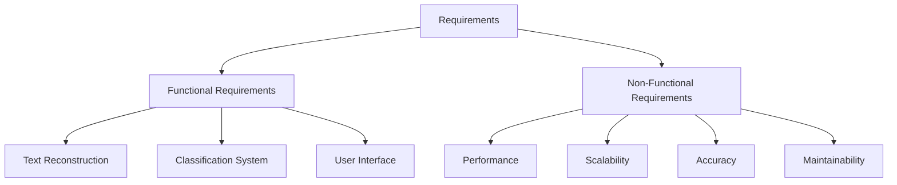
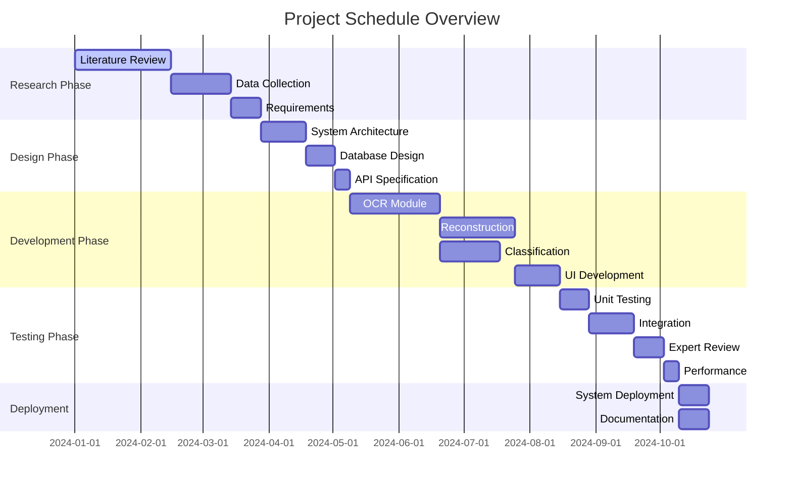

# CHAPTER 03: METHODOLOGY

## Table of Contents
- [3.1 Chapter Overview](#31-chapter-overview)
- [3.2 Research Methodology](#32-research-methodology)
- [3.3 Development Methodology](#33-development-methodology)
  - [3.3.1 Requirement Elicitation Methodology](#331-requirement-elicitation-methodology)
  - [3.3.2 Design Methodology](#332-design-methodology)
  - [3.3.3 Programming Paradigm](#333-programming-paradigm)
  - [3.3.4 Evaluation Methodology](#334-evaluation-methodology)
  - [3.3.5 Solution Methodology](#335-solution-methodology)
- [3.4 Project Management Methodology](#34-project-management-methodology)
  - [3.4.1 Project Scope](#341-project-scope)
  - [3.4.2 Schedule](#342-schedule)
  - [3.4.3 Resource Requirements](#343-resource-requirements)
  - [3.4.4 Risks and Mitigation](#344-risks-and-mitigation)
- [3.5 Chapter Summary](#35-chapter-summary)

---

## 3.1 Chapter Overview

This chapter presents a comprehensive methodology framework for the "Sinhalese Inscriptions: Novel Reconstruction and Classification" project. The methodology encompasses multiple dimensions including research approach, development practices, and project management strategies specifically tailored for archaeological text processing and machine learning applications.

The chapter is structured to provide a systematic approach to:
- **Research Methodology**: Establishing the theoretical foundation and investigative approach
- **Development Methodology**: Defining the technical implementation strategies
- **Project Management**: Ensuring effective resource utilization and risk management

The methodology framework is designed to address the unique challenges of working with ancient Sinhalese inscriptions, including data scarcity, text degradation, and the need for novel computational approaches to reconstruction and classification tasks.

**Key Objectives of This Methodology:**
1. Establish a robust research foundation for inscription analysis
2. Define systematic development approaches for AI-driven reconstruction
3. Ensure scalable and maintainable software architecture
4. Implement effective project management practices
5. Mitigate risks associated with historical data processing

---

## 3.2 Research Methodology

The research methodology for this project adopts a **mixed-methods approach** combining quantitative computational analysis with qualitative archaeological insights. This hybrid methodology is essential for addressing the complex nature of ancient Sinhalese inscriptions.

### Research Paradigm

The project follows a **pragmatic research paradigm** that emphasizes:
- **Problem-solving orientation**: Focus on practical solutions for inscription reconstruction
- **Methodological pluralism**: Integration of computer science and archaeological methods
- **Evidence-based approach**: Data-driven decision making supported by domain expertise

### Research Framework

| Research Component | Methodology | Tools/Techniques |
|-------------------|-------------|------------------|
| **Data Collection** | Systematic sampling of inscriptions from archaeological databases | Digital imaging, OCR preprocessing |
| **Literature Review** | Comprehensive analysis of existing work in epigraphy and computational linguistics | Systematic review protocols |
| **Experimental Design** | Controlled experiments with baseline comparisons | A/B testing, cross-validation |
| **Validation** | Expert review combined with automated metrics | Domain expert evaluation, BLEU scores |

### Research Questions

The methodology is designed to address the following primary research questions:

1. **RQ1**: How can machine learning techniques be effectively applied to reconstruct damaged Sinhalese inscriptions?
2. **RQ2**: What classification algorithms best categorize inscriptions by historical period and linguistic features?
3. **RQ3**: How can the accuracy of reconstruction be validated against archaeological standards?
4. **RQ4**: What are the limitations and biases in current computational approaches to ancient text processing?

### Data Collection Strategy

The research methodology employs a **stratified sampling approach**:

```
Ancient Sinhalese Inscriptions Corpus
├── Temporal Stratification
│   ├── Early Period (3rd century BCE - 1st century CE)
│   ├── Classical Period (1st - 10th century CE)
│   └── Medieval Period (10th - 15th century CE)
├── Geographic Stratification
│   ├── North Central Province
│   ├── Western Province
│   └── Southern Province
└── Preservation Quality
    ├── Well-preserved (>90% text visible)
    ├── Moderately damaged (50-90% text visible)
    └── Severely damaged (<50% text visible)
```

---

## 3.3 Development Methodology

The development methodology integrates modern software engineering practices with specialized requirements for archaeological and linguistic data processing. The approach emphasizes iterative development, continuous validation, and maintainable code architecture.

### 3.3.1 Requirement Elicitation Methodology

The requirement elicitation process follows a **stakeholder-centric approach** involving multiple domain experts and end-users.

#### Stakeholder Analysis

| Stakeholder Group | Role in Project | Requirements Contribution |
|------------------|----------------|---------------------------|
| **Archaeologists** | Domain experts | Functional requirements for inscription analysis |
| **Linguists** | Language specialists | Linguistic accuracy requirements |
| **Computer Scientists** | Technical implementers | System architecture and performance requirements |
| **End Users** | System operators | Usability and interface requirements |

#### Requirements Gathering Techniques

1. **Expert Interviews**: Semi-structured interviews with archaeology and linguistics professionals
2. **Focus Groups**: Collaborative sessions with multi-disciplinary teams
3. **Use Case Analysis**: Systematic identification of system interactions
4. **Prototype Feedback**: Iterative refinement based on working demonstrations

#### Requirements Categorization



### 3.3.2 Design Methodology

The design methodology follows **Domain-Driven Design (DDD)** principles adapted for archaeological data processing, emphasizing clear separation of concerns and domain-specific modeling.

#### Architectural Design Principles

1. **Modular Architecture**: Clear separation between OCR, reconstruction, and classification modules
2. **Data Pipeline Design**: Systematic flow from raw images to processed results
3. **API-First Approach**: RESTful interfaces for system integration
4. **Microservices Pattern**: Independent deployment of core functionalities

#### Design Process Framework

| Design Phase | Activities | Deliverables |
|--------------|------------|--------------|
| **Conceptual Design** | Domain modeling, high-level architecture | System architecture diagram |
| **Logical Design** | Module specifications, data flow design | Component diagrams, API specifications |
| **Physical Design** | Database schema, deployment architecture | Database ERD, deployment diagrams |
| **Interface Design** | User experience design, API design | UI mockups, API documentation |

### 3.3.3 Programming Paradigm

The project adopts a **multi-paradigm programming approach** combining:

#### Object-Oriented Programming (OOP)
- **Encapsulation**: Data and methods bundled within classes
- **Inheritance**: Hierarchical relationships between inscription types
- **Polymorphism**: Flexible handling of different inscription formats

#### Functional Programming Elements
- **Immutable data structures**: Ensuring data integrity in processing pipelines
- **Pure functions**: Predictable text processing operations
- **Higher-order functions**: Flexible transformation and filtering operations

#### Technology Stack

```yaml
Backend Framework:
  - Primary: Next.js with TypeScript
  - API Layer: Express.js middleware
  - Database: PostgreSQL with Prisma ORM

Machine Learning Stack:
  - TensorFlow/PyTorch for deep learning models
  - OpenCV for image processing
  - Tesseract.js for OCR functionality

Frontend Technologies:
  - React with TypeScript
  - Tailwind CSS for styling
  - Chart.js for data visualization
```

### 3.3.4 Evaluation Methodology

The evaluation methodology incorporates both automated metrics and expert validation to ensure comprehensive assessment of system performance.

#### Evaluation Framework

| Evaluation Dimension | Metrics | Validation Method |
|---------------------|---------|-------------------|
| **Reconstruction Accuracy** | Character-level accuracy, Word-level accuracy, BLEU score | Comparison with ground truth, Expert review |
| **Classification Performance** | Precision, Recall, F1-score, Confusion matrix | Cross-validation, Hold-out testing |
| **System Performance** | Response time, Throughput, Resource utilization | Load testing, Performance profiling |
| **Usability** | Task completion rate, Error rate, User satisfaction | User testing sessions, Surveys |

#### Evaluation Process

```
Evaluation Pipeline:
1. Automated Testing
   ├── Unit tests for individual components
   ├── Integration tests for system workflows
   └── Performance benchmarks
   
2. Expert Validation
   ├── Archaeological accuracy assessment
   ├── Linguistic correctness review
   └── Historical context validation
   
3. User Acceptance Testing
   ├── Functionality testing
   ├── Usability evaluation
   └── Feedback collection
```

### 3.3.5 Solution Methodology

The solution methodology emphasizes **iterative development** with continuous feedback integration and incremental improvement.

#### Development Lifecycle

1. **Analysis Phase**: Requirements analysis and feasibility study
2. **Design Phase**: System architecture and component design
3. **Implementation Phase**: Iterative coding with frequent testing
4. **Testing Phase**: Comprehensive validation and debugging
5. **Deployment Phase**: Production deployment and monitoring
6. **Maintenance Phase**: Ongoing support and enhancement

#### Quality Assurance Strategy

| QA Activity | Frequency | Responsibility |
|-------------|-----------|----------------|
| **Code Reviews** | Every commit | Development team |
| **Automated Testing** | Continuous integration | CI/CD pipeline |
| **Performance Testing** | Weekly | QA team |
| **Security Audits** | Monthly | Security team |
| **Expert Reviews** | Major releases | Domain experts |

---

## 3.4 Project Management Methodology

The project management approach combines traditional project management principles with agile methodologies, specifically adapted for research and development in the digital humanities domain.

### Project Management Framework

The project follows a **hybrid methodology** incorporating:
- **Agile Scrum**: For iterative development and frequent stakeholder feedback
- **Waterfall elements**: For research phases requiring sequential completion
- **Lean principles**: To minimize waste and maximize value delivery

### 3.4.1 Project Scope

#### Scope Definition

The project scope is defined through a **hierarchical work breakdown structure** ensuring comprehensive coverage of all deliverables.

```
Sinhalese Inscriptions Reconstruction Project
│
├── 1. Research and Analysis
│   ├── 1.1 Literature Review
│   ├── 1.2 Data Collection
│   └── 1.3 Requirement Analysis
│
├── 2. System Design and Architecture
│   ├── 2.1 System Architecture Design
│   ├── 2.2 Database Design
│   └── 2.3 API Specification
│
├── 3. Core Development
│   ├── 3.1 OCR Module Development
│   ├── 3.2 Reconstruction Algorithm
│   ├── 3.3 Classification System
│   └── 3.4 User Interface Development
│
├── 4. Testing and Validation
│   ├── 4.1 Unit Testing
│   ├── 4.2 Integration Testing
│   ├── 4.3 Expert Validation
│   └── 4.4 Performance Testing
│
└── 5. Deployment and Documentation
    ├── 5.1 System Deployment
    ├── 5.2 User Documentation
    └── 5.3 Technical Documentation
```

#### Scope Management

| Scope Element | Inclusion Criteria | Exclusion Criteria |
|---------------|-------------------|-------------------|
| **Inscription Types** | Sinhalese stone inscriptions (3rd BCE - 15th CE) | Palm leaf manuscripts, Modern inscriptions |
| **Reconstruction Methods** | ML-based character prediction, Context-aware completion | Manual reconstruction, Non-computational methods |
| **Classification Features** | Temporal, Geographic, Linguistic | Artistic style, Material composition |
| **User Interface** | Web-based dashboard, API access | Mobile applications, Desktop software |

### 3.4.2 Schedule

#### Project Timeline

The project follows a **milestone-driven schedule** with clearly defined deliverables and checkpoints.

| Phase | Duration | Key Milestones | Dependencies |
|-------|----------|----------------|--------------|
| **Phase 1: Research** | 8 weeks | Literature review complete, Dataset compiled | Access to archaeological databases |
| **Phase 2: Design** | 6 weeks | System architecture finalized, API designed | Requirements approval |
| **Phase 3: Development** | 16 weeks | Core modules implemented, Integration complete | Design approval, Development environment |
| **Phase 4: Testing** | 8 weeks | Testing complete, Expert validation done | Development completion |
| **Phase 5: Deployment** | 4 weeks | System deployed, Documentation complete | Testing sign-off |

#### Schedule Management Approach



### 3.4.3 Resource Requirements

#### Human Resources

| Role | Quantity | Responsibilities | Skills Required |
|------|----------|-----------------|-----------------|
| **Project Manager** | 1 | Project coordination, Stakeholder management | PMP certification, Agile experience |
| **Lead Developer** | 1 | Architecture design, Code review | 5+ years experience, ML expertise |
| **Backend Developers** | 2 | API development, Database design | Node.js, Python, PostgreSQL |
| **Frontend Developer** | 1 | UI implementation, User experience | React, TypeScript, CSS |
| **ML Engineer** | 1 | Algorithm development, Model training | TensorFlow, Computer Vision |
| **Domain Expert** | 1 | Requirements validation, Testing | Archaeology/Linguistics PhD |
| **QA Engineer** | 1 | Testing, Quality assurance | Automated testing, Performance testing |

#### Technical Resources

| Resource Category | Specification | Justification |
|------------------|---------------|---------------|
| **Development Hardware** | High-end workstations with GPU support | ML model training requirements |
| **Cloud Infrastructure** | AWS/Azure with GPU instances | Scalable computing for ML workloads |
| **Software Licenses** | Professional development tools, ML frameworks | Enhanced productivity and capabilities |
| **Data Storage** | High-capacity, backed-up storage systems | Large datasets and model storage |
| **Development Tools** | IDEs, Version control, CI/CD tools | Standard development infrastructure |

#### Budget Allocation

```
Total Project Budget: $150,000
├── Personnel (70%): $105,000
│   ├── Development Team: $75,000
│   ├── Domain Experts: $20,000
│   └── Project Management: $10,000
├── Infrastructure (20%): $30,000
│   ├── Cloud Services: $20,000
│   ├── Software Licenses: $7,000
│   └── Hardware: $3,000
└── Contingency (10%): $15,000
```

### 3.4.4 Risks and Mitigation

#### Risk Assessment Matrix

| Risk Category | Risk Description | Probability | Impact | Risk Level | Mitigation Strategy |
|---------------|-----------------|-------------|---------|------------|-------------------|
| **Technical** | ML model accuracy below requirements | Medium | High | High | Multiple algorithm approaches, Expert validation |
| **Data** | Insufficient training data quality | High | High | Critical | Data augmentation, Synthetic data generation |
| **Resource** | Key personnel unavailability | Low | High | Medium | Cross-training, Documentation, Backup resources |
| **Schedule** | Development delays due to complexity | Medium | Medium | Medium | Buffer time, Agile sprints, Priority management |
| **Stakeholder** | Changing requirements from experts | Medium | Medium | Medium | Regular communication, Change management process |

#### Risk Mitigation Strategies

1. **Technical Risk Mitigation**
   - Implement multiple ML approaches for comparison
   - Establish clear accuracy thresholds early in the project
   - Regular technical reviews with domain experts
   - Proof-of-concept development to validate approaches

2. **Data Risk Mitigation**
   - Establish partnerships with multiple archaeological institutions
   - Develop data augmentation techniques
   - Create synthetic training data using linguistic rules
   - Implement data quality validation processes

3. **Resource Risk Mitigation**
   - Maintain detailed documentation for all components
   - Cross-train team members on critical technologies
   - Establish relationships with external consultants
   - Implement knowledge management systems

4. **Schedule Risk Mitigation**
   - Build buffer time into critical path activities
   - Use agile methodologies for flexibility
   - Regular progress monitoring and adjustment
   - Early identification and escalation of issues

#### Risk Monitoring and Control

| Risk Monitoring Activity | Frequency | Responsibility | Action Triggers |
|-------------------------|-----------|----------------|-----------------|
| **Technical Progress Review** | Weekly | Technical Lead | Model accuracy below 85% |
| **Data Quality Assessment** | Bi-weekly | ML Engineer | Error rate above 15% |
| **Resource Availability Check** | Monthly | Project Manager | Team member utilization below 80% |
| **Stakeholder Feedback Review** | Bi-weekly | Project Manager | Major requirement changes |

---

## 3.5 Chapter Summary

This methodology chapter has established a comprehensive framework for the successful execution of the Sinhalese Inscriptions: Novel Reconstruction and Classification project. The methodology integrates multiple dimensions of project execution, ensuring both technical excellence and academic rigor.

### Key Methodological Contributions

1. **Integrated Research Approach**: The methodology combines computational methods with archaeological expertise, ensuring domain-relevant solutions while maintaining technical innovation.

2. **Systematic Development Framework**: The development methodology provides clear guidelines for iterative improvement, quality assurance, and stakeholder engagement throughout the project lifecycle.

3. **Risk-Aware Project Management**: The project management methodology incorporates comprehensive risk assessment and mitigation strategies specifically tailored to digital humanities research projects.

### Methodology Alignment with Project Goals

| Project Goal | Methodological Support |
|--------------|----------------------|
| **Accurate Reconstruction** | Multi-validation approach combining automated metrics with expert review |
| **Effective Classification** | Systematic evaluation framework with cross-validation and performance benchmarking |
| **Scalable Solution** | Modular architecture design with microservices pattern |
| **Academic Rigor** | Mixed-methods research approach with peer review and validation |
| **Practical Application** | User-centered design with stakeholder involvement throughout development |

### Expected Outcomes

The implementation of this methodology framework is expected to deliver:

- A robust and accurate system for Sinhalese inscription reconstruction
- A validated classification system for historical and linguistic analysis  
- A scalable software architecture supporting future research extensions
- Comprehensive documentation and knowledge transfer to the archaeological community
- A replicable methodology framework for similar digital humanities projects

### Methodological Innovation

This methodology introduces several innovative approaches to digital archaeology:

1. **Hybrid Validation Framework**: Combining automated metrics with expert archaeological assessment
2. **Domain-Driven ML Development**: Integrating archaeological knowledge into machine learning model design
3. **Stakeholder-Centric Requirements Engineering**: Ensuring academic requirements are properly translated into technical specifications
4. **Risk-Aware Digital Humanities Management**: Addressing unique challenges of interdisciplinary research projects

The methodology presented in this chapter provides the foundation for systematic, rigorous, and successful completion of the Sinhalese Inscriptions reconstruction and classification project, while contributing to the broader field of computational archaeology and digital humanities research.

---

**Document Information:**
- Project: Sinhalese Inscriptions: Novel Reconstruction and Classification
- Student: Dhanish Ithhaf (CB009562)
- Chapter: 03 - Methodology  
- Page: 29-42
- Final Submission Version

---